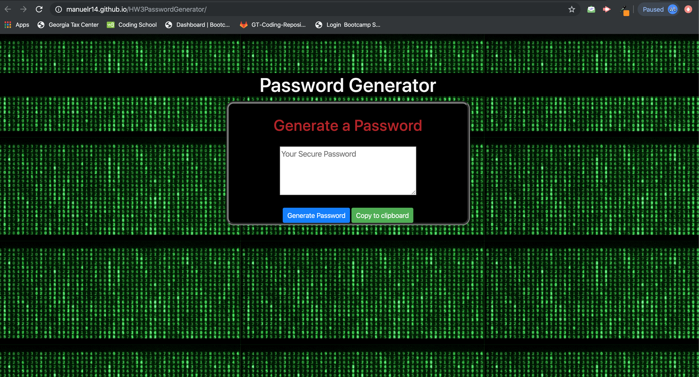

# HW3PasswordGenerator

A password generator is a software tool that creates random or passwords for users. This program produce complex/strong passwords with combinations of numbers, uppercase and lowercase letters, and special characters such as braces, asterisks, slashes, etc. It helps users create stronger passwords that provide greater security for a given type of access.

here is the link to see the password generator https://manuelr14.github.io/HW3PasswordGenerator/

pseudo codigo;

1- declare variables posibles in password;

    a- upper characteres;

    b- lower characteres;

    c- numbers;

    d- symbols ;

    e- generate button ;

    f- copy to clipboard button;

    e- display where we're going to show the results;

2- listen if our generate button is clicked;

    a- prompt paswordLenght (between 8- 128);

        a2- if is between the right range go to b-;

        a1- if not between 8- 128 alert error message;

    b-confirm characters types and save in variables;

    c- declare variable passwordf empty where we are going to add our    characters depending on types selected;

    d- generate password in every character type combination(16 possible combinations);

        d1- IF upper=true & lower=true & number=true & symbol=true;

        d2- loop "passwordLenght" times;

        d3- save in our variable passwordf previus declared in 
        c- same variable + a ramdon selector from upper variable UPPER[ramdom] + a ramdon selector from lower variable lower[ramdom] + a ramdon selector from number variable number[ramdom] + a ramdom selector from symbol variable special[ramdom] 

            passwordf=passwordf+UPPER[ramdom]+lower[ramdom]+number[ramdom]+special[ramdom];

        d4- consol.log to see the password generated;
        

        d5-create a new variable called pnumero to save the first        (passwordlenght) characters from the password generated;

        d6- display the pnumero in the text area of our html;

        d7-ELSE IF second posible character type combination and all the combinations;

        d8- ELSE alert error message;
